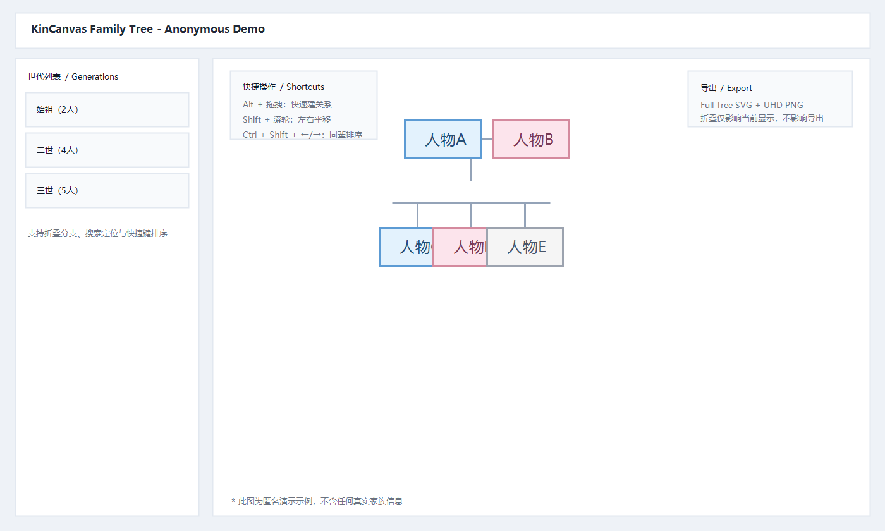

# KinCanvas Family Tree（家谱可视化编辑器）

KinCanvas 是一个离线优先的家谱管理网页应用，帮助你通过可视化方式维护成员、关系和家族结构，并支持整谱高清导出与版本回溯。

## 目录

- [项目简介](#项目简介)
- [界面预览](#界面预览)
- [最近更新](#最近更新)
- [核心功能](#核心功能)
- [快速开始](#快速开始)
- [高频操作](#高频操作)
- [快捷键](#快捷键)
- [数据与文件](#数据与文件)
- [导出与导入](#导出与导入)
- [项目结构](#项目结构)
- [开发与调试](#开发与调试)
- [注意事项](#注意事项)
- [路线图](#路线图)
- [贡献方式](#贡献方式)
- [许可证](#许可证)

## 项目简介

- 纯前端离线应用，无需后端服务。
- 支持成员管理、关系管理、历史回退、版本快照。
- 支持较大规模家谱布局与渲染优化。
- 支持导出完整族谱矢量图和超清图片。

## 界面预览



[查看 SVG 原图](./docs/images/preview-anonymous.svg)

> 上图为匿名演示图，不包含任何真实家族信息。

## 最近更新

- 2026-04-22：新增“节点折叠子树”与“一键全部展开”。
- 2026-04-22：搜索命中会自动展开路径，避免命中节点被折叠遮挡。
- 2026-04-22：新增 `Shift + 滚轮` 横向平移。
- 2026-04-22：新增 `Ctrl + Shift + ←/→` 同辈顺序左移/右移。
- 2026-04-22：节点图片支持删除与全屏查看（含 `Ctrl + 鼠标` 快速放大）。

## 核心功能

- 成员管理：新增、编辑、删除成员。
- 关系管理：配偶、父母/子女、兄弟姐妹。
- 关系建立方式：
  - 右键节点菜单。
  - `Alt + 拖拽` 节点到另一个节点后选择关系类型。
- 布局与视图：
  - 纵向/横向布局切换。
  - 拖拽平移、滚轮缩放、`Shift + 滚轮` 横向平移、适应屏幕。
  - 兄弟姐妹拖拽排序。
  - 节点折叠子树与“一键全部展开”。
- 搜索与定位：按姓名、备注等字段搜索并跳转。
- 历史能力：撤销、前进、版本保存与恢复。
- 导出能力：
  - `SVG`（默认完整矢量图）
  - 超清 `PNG`
  - `JSON`（数据备份）

## 快速开始

1. 使用 Chrome 或 Edge 打开 `jiapu.html`。
2. 点击顶部“连接”按钮，选择本地数据目录。
3. 添加第一位成员（根节点）。
4. 通过右键或 `Alt + 拖拽` 建立成员关系。
5. 阶段完成后点击“保存版本”。

## 高频操作

- 空白处鼠标左键双击：快速创建独立节点。
- 节点上鼠标左键双击：编辑节点信息。
- 选中节点后按 `Delete`：删除节点。
- 节点上右键：打开节点关系菜单。
- `Alt + 拖拽`：快速建立节点间关系。
- 拖拽兄弟姐妹节点：调整同辈顺序。
- 点击节点右下角折叠按钮：折叠/展开该节点下方分支（包含后代配偶）。
- 顶部“展开全部”：恢复全图显示。
- 点击节点图片：全屏查看；`Ctrl + 鼠标` 也可快速放大查看。

## 快捷键

### 全局快捷键（默认）

- `Ctrl + Z`：撤销
- `Ctrl + Y`：前进
- `Ctrl + S`：保存版本
- `Ctrl + Shift + N`：添加人物
- `Ctrl + E`：编辑选中人物
- `Delete`：删除选中人物
- `Ctrl + F`：搜索
- `Ctrl + 0`：适应屏幕
- `Ctrl + =`：放大
- `Ctrl + -`：缩小
- `Ctrl + /`：快捷键设置
- `Ctrl + B`：切换侧边栏
- `Ctrl + Shift + ←`：当前节点在同辈中左移一位
- `Ctrl + Shift + →`：当前节点在同辈中右移一位
- `Esc`：取消/关闭
- 方向键：在亲属间导航

### 菜单快捷键（默认）

- 右键菜单：`A/S/D/F/E/X`
- 关系菜单：`A/D/S/F`

> 提示：菜单快捷键可在“快捷键设置”中自定义。

## 数据与文件

连接本地目录后，应用会在 `data/` 下维护数据文件：

- `state.json`：当前家谱状态
- `history.json`：操作历史
- `shortcuts.json`：快捷键配置
- `settings.json`：应用设置
- `versions/`：版本快照

## 导出与导入

### 导出

- 导出图片按钮会同时导出：
  - `家谱_日期.svg`（完整矢量图）
  - `家谱_日期_超清.png`（完整超清位图）
- 即使当前画面有折叠分支，导出仍默认输出完整族谱。
- 另支持导出 `JSON` 用于备份与迁移。

### 导入

- 导入 `JSON` 会覆盖当前数据（可通过撤销恢复）。
- 如果已连接目录，导入后会同步写入本地数据文件。

## 项目结构

```text
jiapu_app/
├─ jiapu.html
├─ css/
│  └─ styles.css
├─ js/
│  ├─ state.js
│  ├─ history.js
│  ├─ filesystem.js
│  ├─ layout.js
│  ├─ renderer.js
│  ├─ shortcuts.js
│  └─ ui.js
├─ data/
├─ scripts/
└─ README*.md
```

## 开发与调试

- 本项目是静态网页，直接在浏览器打开即可运行。
- 若需修改逻辑，建议重点从以下文件入手：
  - 布局与坐标：`js/layout.js`
  - 渲染与拖拽：`js/renderer.js`
  - 交互与导出：`js/ui.js`
  - 快捷键：`js/shortcuts.js`

## 注意事项

- 开源前请移除个人隐私数据（成员真实信息、照片、私密备份等）。
- 建议始终使用同一个数据目录，避免版本分散。
- 大规模改动前后建议各保存一个版本快照。
- 不建议手工修改 `data/*.json`，优先通过页面操作。

## 路线图

- 关系一致性体检工具（孤立节点/冲突关系检查）。
- 更灵活的导出选项（分辨率、纸张、分页）。
- 大规模数据下的进一步性能优化。
- 更完整的多语言界面文案。

## 贡献方式

欢迎提交 Issue / PR：

1. Fork 仓库并创建分支。
2. 提交改动并说明问题背景与改动点。
3. 提交 PR，尽量附带复现步骤与验证结果。

## 许可证

建议使用 MIT 许可证（如仓库尚未添加，请在发布前补充 `LICENSE` 文件）。
